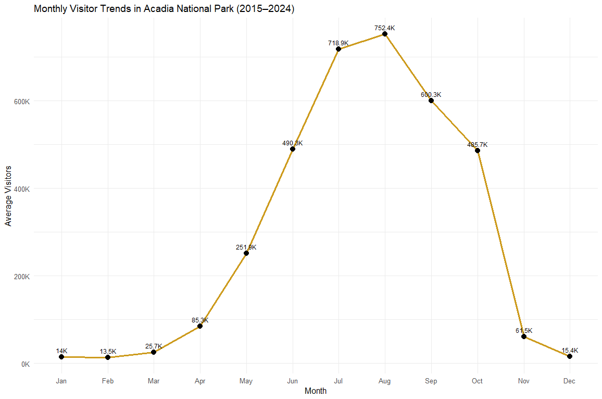
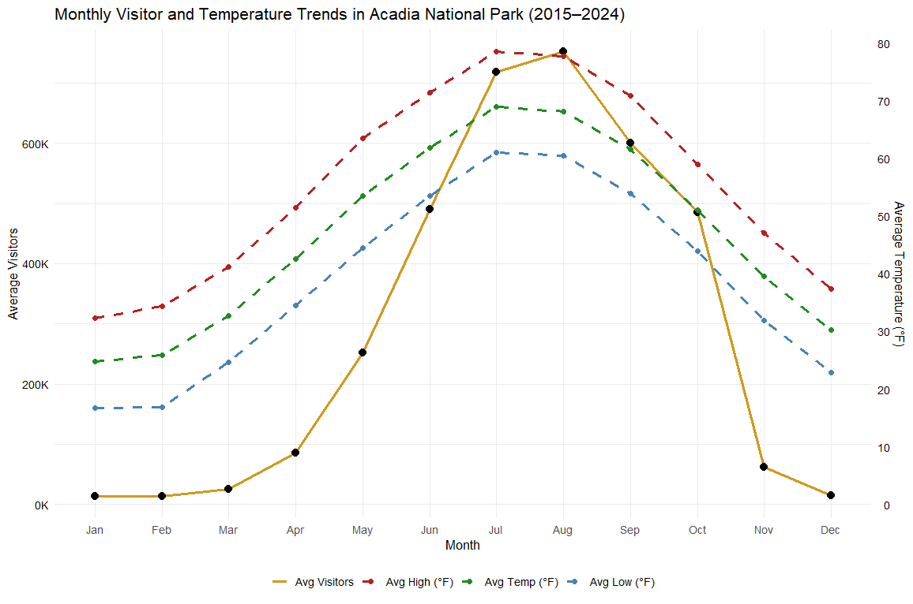
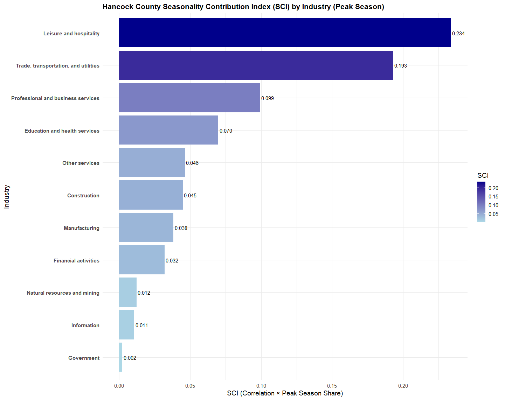
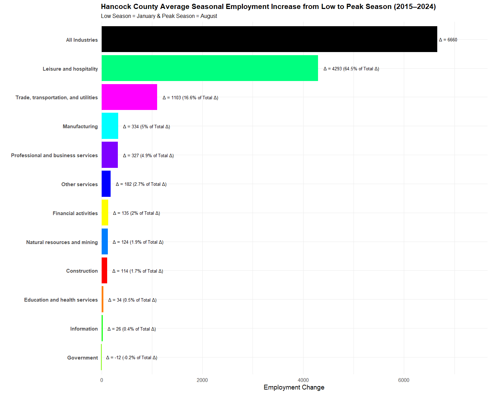
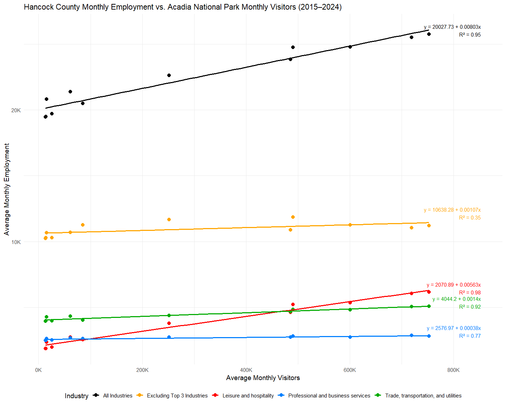

# Tourism and Jobs in Maine: Evaluating Acadia National Park's Impact on Local Employment

## Overview

This project analyzes how seasonal tourism at Acadia National Park relates to local employment in Maine. Using monthly data from 2015–2024, I combined park visitation, weather, and county-level employment data to examine seasonal patterns and quantify the relationship between tourism activity and employment.

## Data Sources

- National Park Service (NPS) — monthly Acadia National Park visitation
- National Oceanic and Atmospheric Administration (NOAA) — monthly weather data
- U.S. Bureau of Labor Statistics (BLS) — county-level employment by industry

## Methods

The analysis was conducted in R and included:

- Data cleaning and integration across multiple sources
- Seasonal and time-series analysis
- Correlation analysis
- Industry-level employment analysis
- Seasonality Contribution Index (SCI)
- Linear regression

## Key Findings

- Acadia visitation is highly seasonal, with the majority of visitors arriving during the summer and early fall.
- Leisure & Hospitality employment showed the strongest relationship with seasonal park visitation.
- Leisure & Hospitality had a correlation of approximately 0.99 with Acadia visitation.
- The regression analysis estimated approximately one additional Leisure & Hospitality job for every 178 additional monthly visitors.
- The model explained approximately 98% of the variation in Leisure & Hospitality employment (R² ≈ 0.98).

## Selected Visualizations

### Monthly Visitor Trends

### Tourism Seasonality and Temperature

### Industry Seasonality

### Seasonal Employment Increase

### Employment and Acadia Visitation

## Project Files

- `final-project.R` — primary analysis and visualization code
- `generate-employment-data.R` — employment data preparation
- `final-report.pdf` — complete project report
- `final-presentation.pdf` — project presentation

## Tools

**R** | Data Wrangling | Statistical Analysis | Regression | Data Visualization
